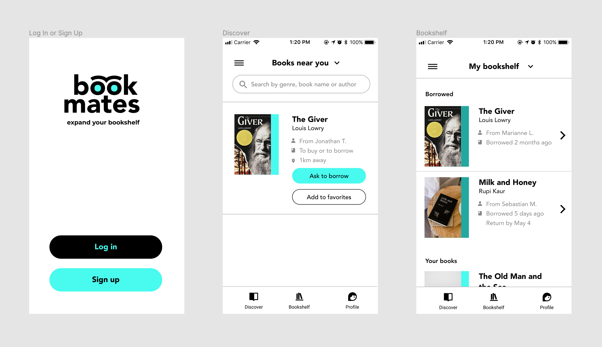

# Bookmates

## What is Bookmates?

Bookmates is a React Native application that connects people through the books they read.

---

### Use cases

1. **Add books** that you are willing to share with other people near you
2. Browse and **discover** books near you
3. **Favorite** books you would like to read
4. Send a **borrow request** to borrow books from other users

---

### Screens



---

### Tools

- React Native
- JavaScript
- Firebase
- Redux
<!--

---

### Requirements

_Work in Progress_

---

### Edge Cases

_Work in Progress_ -->

---

### Contributor setup

**1. Fork this repository and cd into it**

```
git clone https://github.com/Coral-Tech/bookmates
cd bookmates/`
```

**2. Create and activate a virtual environment**

- MacOS/Linux

```
virtualenv --no-site-packages env
source env/bin/activate
```

- Windows

```
virtualenv env
.\env\Scripts\activate
```

**3. Install npm**

[Download link](https://nodejs.org/en/)

**4. Install Expo**

```
npm install -g expo-cli
```

**5. Install required JS packages from packages.json**

```
npm install
```

**6. Run Expo**

```
expo start
```
